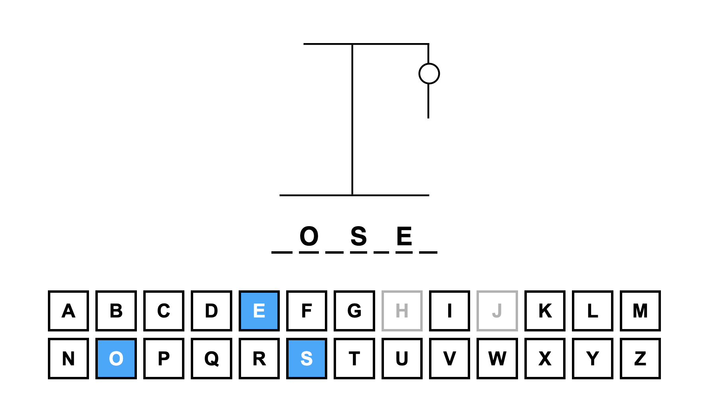

# Hangman with React and TypeScript

Done for educational purposes. Deploy [here](https://hangman-ts-gamma.vercel.app/)

This is an attempt to do a cool version of Hangman that will have a different word per day

## Tutorial & Motivation

I started following the logic of [Web Dev Simplified's great tutorial on the topic](https://www.youtube.com/watch?v=-ONUyenGnWw) but quickly made it more complex adding other features like LocalStorage and Word per Day.
I want to start diving in the topic of gamification and want to start simple. This game will open me the doors to some more complex logic where users will be rewarded for their score.

## Features

- ⭐️ Easy and simple UI created with CSS Modules and React
- 🚀 Logic created with TypeScript & React Hooks
- 🗓️ A new word per day will be available to be played. You will not be able to play days beyond today, but of course you can try to get all the words of previous days
- 🎮 It is a game. Simple. No data gathering. That is why the information is stored in your computer in the LocalStorage

## Future ToDos

- [ ] Add other avatars
- [ ] Add level up UI and logic
- [ ] Add daily bonus UI
- [ ] Add daily bonus logic
- [ ] Add mini shop system to buy a hint for the current word of the day
- [ ] Add some achievement ui overlay
- [ ] Add first achievemnets (guess your first word, guess 5 words)
